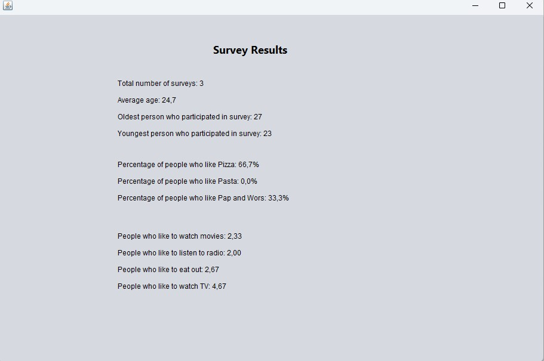

# Survey
This is a Java-based desktop survey application built using **Swing**, with a focus on strong backend functionality using **SQLite** for data persistence.

## Features
- Collects personal information: full name, email, date of birth, contact number
- Allows users to select favourite food preferences
- Includes a dynamic agreement-scale survey (1–5)
- Ensures only one selection per survey item
- Validates all input fields before submission
- Stores all data securely in a local SQLite database
- Records submission timestamp for each entry
- Provides a **Results Page** with:
  - Average age
  - Youngest and oldest participants
  - Percentage of food preferences
  - Average ratings per statement

## Technologies Used
- **Java 21**
- **Swing (GUI)**
- **SQLite (via JDBC)**
- **FlatLaf (for modern UI appearance)**
- **Maven** (for project management and dependencies)

## How to Run
### 1. Requirements
- Java 17 or newer installed
### 2. Run the App
Navigate to the project directory in terminal and run:
java -jar target/Survey-1.0-SNAPSHOT-jar-with-dependencies.jar

## Survey Form UI

## Results Page

